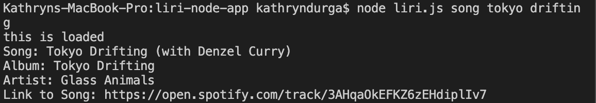

# Liri Node App
The liri node app includes a variety of search functions.  The user can search for concerts, songs, movies, and a random surprise option.  Example images shown below.

## How to for searching with liri:
The user first types "node liri.js"

This is followed by a command word - either "concert", "song", "movie", or "random".

For a concert search the user types "concert" followed by the artist name of their choosing wrapped in quotes.  This returns the artist name, venue, venue location, and date of their next concert. 

For a song search the user types "song" followed by the song name of their choice wrapped in quotes.  This returns the song name, album name, the artist, and a link to the song on spotify.

For a movie search the user types "movie" follwed by the movie name of their choosing wrapped in quotes.  This returns the movie title, year, IMDB rating, Rotten Tomatoes rating, country, language, actors, and a brief plot summary.

For a random search the user need only type the "random" command.

## Resources used:
-axios
-Bands in town API
-Spotify API
-OMDB API
______

### Search for concerts:

### Search for songs:

### Search for movies:

### Search random to get a surprise result:

